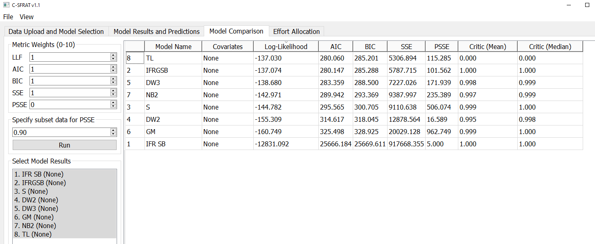
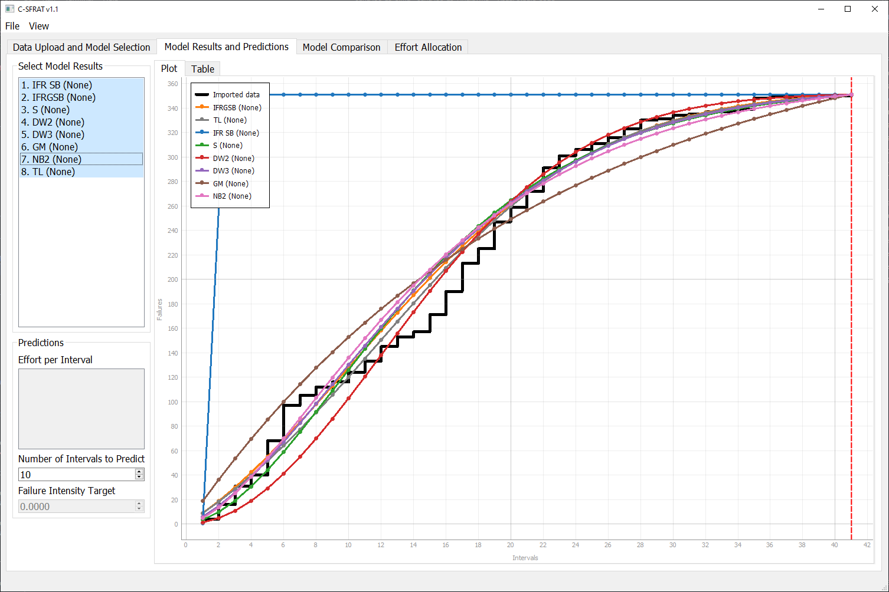
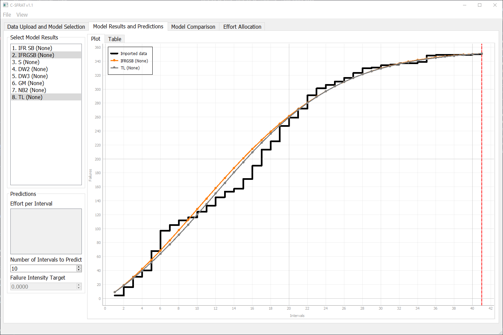
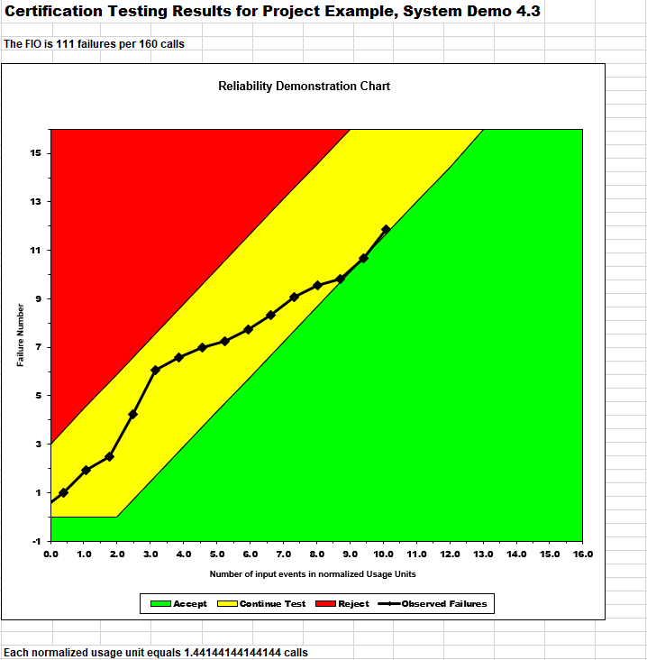
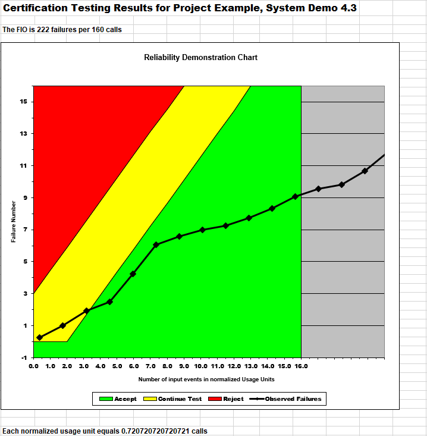

**SENG 438- Software Testing, Reliability, and Quality**

**Lab. Report \#5 – Software Reliability Assessment**

| Group: 8        |
| --------------- |
| Jiawei He       |
| Nicholas Garcia |
| Sarah Qin       |
| Findlay Brown   |

# Introduction

# 

# Assessment Using Reliability Growth Testing 

## Model Comparison

| Model                                |                         MTTF |                 Failure Rate |
| ------------------------------------ | ---------------------------: | ---------------------------: |
| Data                                 |     $\frac{41}{351} = 0.117$ |     $\frac{351}{41} = 8.561$ |
| Discrete Weibull Type III (All data) |     $\frac{41}{351} = 0.117$ |     $\frac{351}{41} = 8.561$ |
| Truncated Logistic (All Data)        |     $\frac{41}{351} = 0.117$ |     $\frac{351}{41} = 8.561$ |
| Discrete Weibull Type III (Subset)   | $\frac{41}{362.536} = 0.113$ | $\frac{362.536}{41} = 8.842$ |
| Truncated Logistic (Subset)          | $\frac{41}{356.605} = 0.115$ | $\frac{356.605}{41} = 8.698$ |

- Subset: the model uses the first 31 data points and then predicts the last 10.

# Assessment Using Reliability Demonstration Chart 
The dataset we used was CDS. Since the RDC file takes up to 16 data points, the first 16 data points were used. In addition to this, the cumulative faliure count on the graph only went up to 16. To ensure all data could be seen on the graph, each input of cumulative faliure counts was divided by 16. With this in mind, the minimum mttf is 0.69. All other aspects, such as the risk parameters were kept constant at the default.

# MTTFMin

# Half MTTFMin

# Double MTTFMin

The graphs above shows the RDC of MinMTTF, half MinMTTF, and double MinMTTF. Determing MinMTTF was done through trial and error, where the values for maximum failures and input events were experimented with. To get the MinMTTF, at least one point on the graph must be in the accept zone. After determining MinMTTF, it was then changed to have it doubled and halved to get the other two graphs.

# Comparison of Results

# Discussion on Similarity and Differences of the Two Techniques

# How the team work/effort was divided and managed

# 

# Difficulties encountered, challenges overcome, and lessons learned

# Comments/feedback on the lab itself

Having the failure datasets in the incorrect format made it difficult to get started with C-SFRAT and STRAT. Also the lack of documentation on how to use STRAT made it difficult to use for the Reliability Demonstration Chart (RDC) in part 2. There was very little information about how to import the data into the RDC. Also, manipulating the RDC to fit all of the necessary data was complicated and may have affected our results since we have to manipulate and limit our data so that the graph looked good enough. 