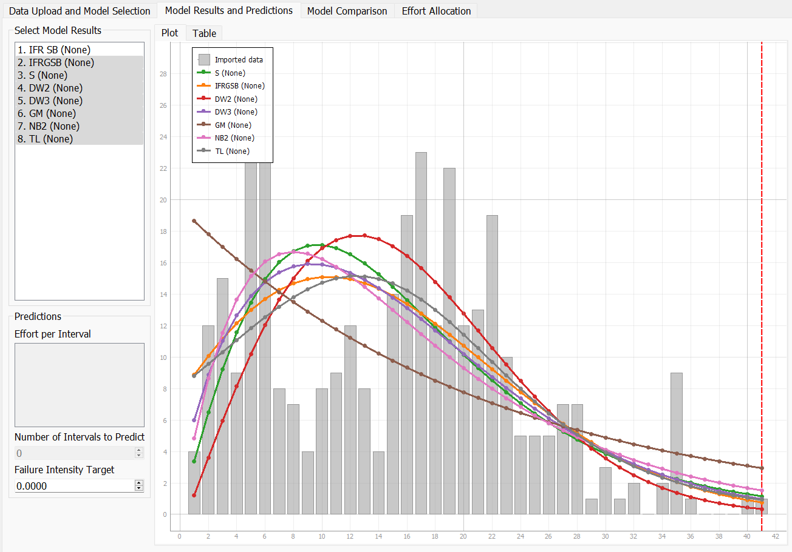
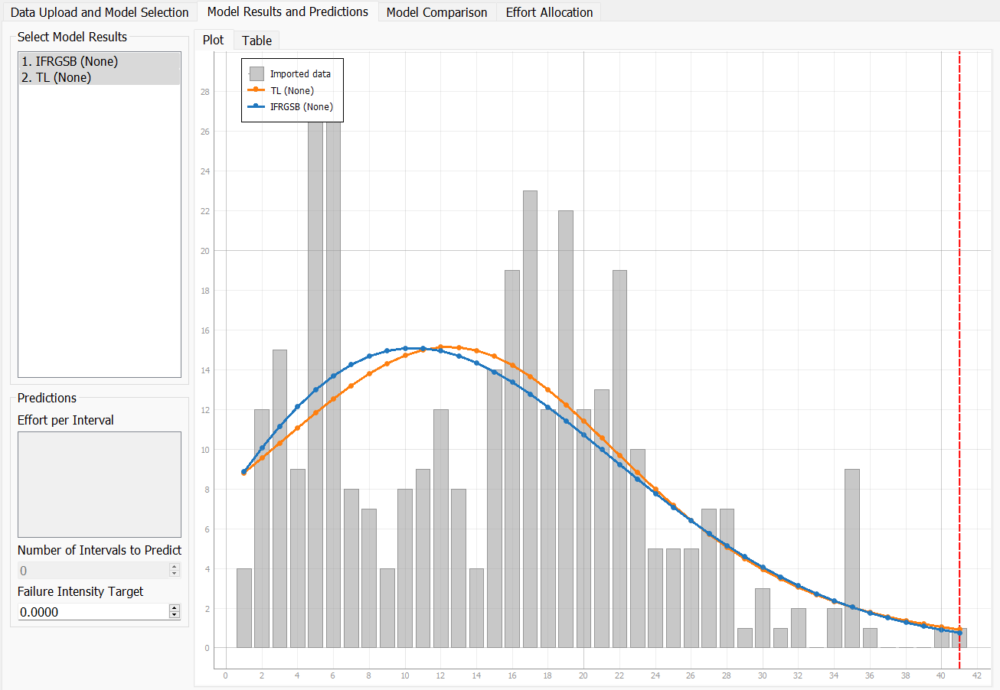
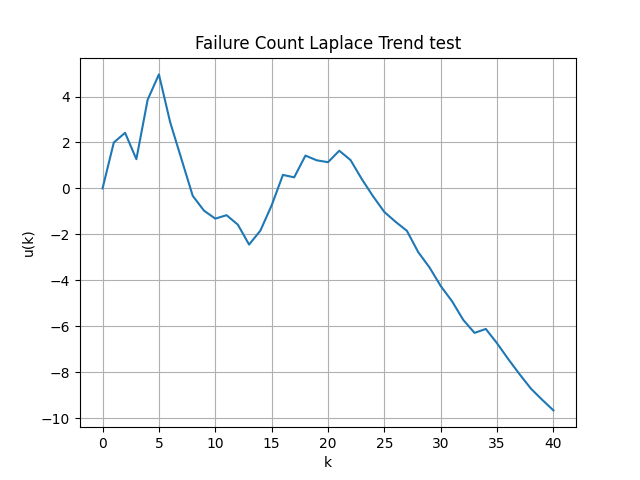
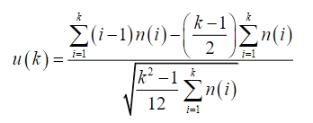

**SENG 438- Software Testing, Reliability, and Quality**

**Lab. Report \#5 – Software Reliability Assessment**

| Group: 8        |
| --------------- |
| Jiawei He       |
| Nicholas Garcia |
| Sarah Qin       |
| Findlay Brown   |

# Introduction

The purpose of this lab is to analyze integration test data using reliability assessment tools such as reliability growth testing and Reliability Demonstration Chart (RDC) and to be familiar with them. These tools allows us to measure failure rate, MTTF, and to assess the reliability given its failure data.

#

# Assessment Using Reliability Growth Testing

## Model Comparison

### Model Comparison Table

### Model Comparison MVF Graph

### Model Comparison Intensity Graph

## Top 2 Models

### Top 2 Models MVF Graph

### Top 2 Models Intensity Graph

| Model                                |                         MTTF |                 Failure Rate |
| ------------------------------------ | ---------------------------: | ---------------------------: |
| Data                                 |     $\frac{41}{351} = 0.117$ |     $\frac{351}{41} = 8.561$ |
| Discrete Weibull Type III (All data) |     $\frac{41}{351} = 0.117$ |     $\frac{351}{41} = 8.561$ |
| Truncated Logistic (All Data)        |     $\frac{41}{351} = 0.117$ |     $\frac{351}{41} = 8.561$ |
| Discrete Weibull Type III (Subset)   | $\frac{41}{362.536} = 0.113$ | $\frac{362.536}{41} = 8.842$ |
| Truncated Logistic (Subset)          | $\frac{41}{356.605} = 0.115$ | $\frac{356.605}{41} = 8.698$ |

- Subset: the model uses the first 31 data points and then predicts the last 10.

## Laplace Trend Test

From inspecting the Laplace trend test results it is clear that the range of useful data is 8-24 and 24-41. Where 8-24 the reliability growth is stable, values between ±2. The values in the range 24-41 are all negative and are decreasing in value which indicates that the reliability growth is increasing.

The Laplace trend test was calculated using the following formula:

The formula was translated into a python script that can be found here [Laplace Trend Test Calculator](https://github.com/FindlayMB/Python-Tools).

# Advantages and Disadvantages of Reliability Growth

The advantage of Reliability Growth is that it shows the reliability of the SUT overtime, we can identify and rectify the defects and weaknesses of the system based on the changes on the graph. The disadvantages of Reliability Growth are that it requires significant time as we require more failure data to analyza the reliability of the SUT.

# Assessment Using Reliability Demonstration Chart

The dataset we used was CDS. Since the RDC file takes up to 16 data points, the first 16 data points were used. In addition to this, the cumulative faliure count on the graph only went up to 16. To ensure all data could be seen on the graph, each input of cumulative faliure counts was divided by 16. With this in mind, the minimum mttf is 0.69. All other aspects, such as the risk parameters were kept constant at the default.

# MTTFMin

# Half MTTFMin

# Double MTTFMin

The graphs above shows the RDC of MinMTTF, half MinMTTF, and double MinMTTF. Determing MinMTTF was done through trial and error, where the values for maximum failures and input events were experimented with. To get the MinMTTF, at least one point on the graph must be in the accept zone. After determining MinMTTF, it was then changed to have it doubled and halved to get the other two graphs.

# Advantages and Disadvantages of RDC

The advantages of RDC are that it is time and cost efficient and we can experiment with different confidence levels and MTTF. The disadvantages of RDC are that it does not provide a quantitative value for reliability as it only shows whether the SUT is acceptable or not, and it is an open source project, anyone who has access to it can change the nature of it.

# Comparison of Results

The mttf found in both parts are very different, where part 1 calculated an mttf of 0.117 and part 2 calculated an mttf of 0.69. However we believe that the result from part 1 is much more accurate because a formula was used to calculate the mttf whereas the mttf calculated from part 2 relied solely on how it looked on the graph. Another reason for the difference in results could be because of the amount of data used. Since RDC could only take in 16 data points, the first 16 data points were used, but for C-SFRAT the first 31 points were used.

# Discussion on Similarity and Differences of the Two Techniques

The similarity between RDC and Reliability Growth is that they both use inter failure times and MTTF to determine the reliability of the data. The difference is that Reliability Growth can take failure count along with the inter failure times and MTTF to determine the reliability. Another difference is that RDC can only indicate whether the SUT is acceptable or not. In comparison, Reliability Growth shows whether the SUT undergoes reliability growth, decrease, or its stable reliability. In other words, RDC does not provide a quantitative measurement of reliability, but the Laplace Factor in Reliability Growth can gives quantitative measure of reliability.

# How the team work/effort was divided and managed

For part 1, Findlay and Javy used C-SFRAT to create the failure rate and reliability plots for the SUT. Findlay created a python script to generate the Laplace trend test results. For part 2, Nick and Sarah used the RDC-11 tool to create the RDC graphs for different "what-if" scenarios and MTTF values.

# Difficulties encountered, challenges overcome, and lessons learned

Having the failure datasets in the incorrect format made it difficult to get started with C-SFRAT and STRAT. Also the lack of documentation on how to use STRAT made it difficult to use for the Reliability Demonstration Chart (RDC) in part 2. There was very little information about how to import the data into the RDC. Also, manipulating the RDC to fit all of the necessary data was complicated and may have affected our results since we have to manipulate and limit our data so that the graph looked good enough.

# Comments/feedback on the lab itself

It was difficult to get started with C-SFRAT and STRAT as there are not enough information on how to use the tools, it would be great to provide more information on the assessment tools.
